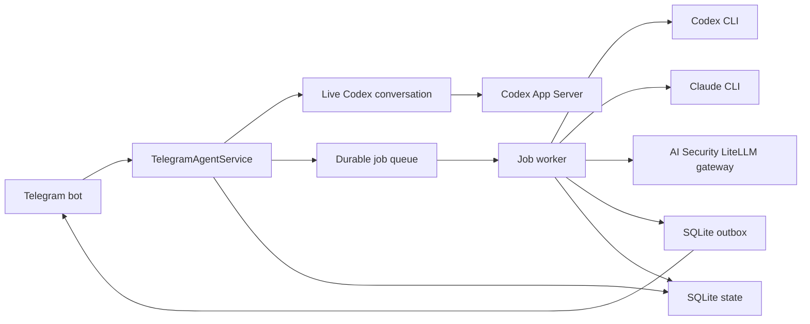

# AIMessenger Architecture

## Purpose

AIMessenger connects one allowlisted Telegram account to coding-agent sessions running on a private host. Telegram is only the transport: agent processes, credentials, source code, files, logs, and persistent state remain on the host.



## Request routing

| Incoming message | Execution path | Session behavior |
| --- | --- | --- |
| Text-only message with a standard Codex model | Live Codex App Server | One persistent Codex conversation; later messages steer the active turn. |
| Claude message | Durable job worker and Claude CLI | Native Claude session is retained only while the agent marks the task as continuing. |
| Selected gateway model | Durable job worker and local LiteLLM-compatible gateway | Stateless request with a required standard tool-call loop for memory access. |
| Any Telegram attachment | Durable job worker | The attachment is downloaded to the job directory and passed to the selected provider. |

The live Codex path sends the first real Codex progress message, maintains Telegram's typing indicator, and sends the completed answer. The worker path sends no queue acknowledgement: it maintains the typing indicator until the final result is delivered.

`/model` owns a short-lived numeric-selection state. A message is treated as a model choice only when it contains a number and nothing else; all other messages remain normal prompts. Changing models, or running `/new codex`, ends the live Codex thread so the next request starts with the newly selected model.

## Durable state and delivery

Runtime state is stored in `aimessenger.sqlite` inside `AIMESSENGER_DATA_DIR`.

| Data | Purpose |
| --- | --- |
| Jobs | Queued, running, completed, failed, or interrupted agent work; selected model; token usage; and recorded cost metrics. |
| Sessions | Separate provider-native session IDs and conversation continuity state. |
| Outbox | Completed text and attachments awaiting confirmed Telegram delivery. |
| Files | Per-job downloaded inputs and generated outputs. |
| JSONL logs | Lifecycle, queue, delivery, model, and error metadata without message bodies, replies, tokens, or attachment paths. |

The outbox makes provider completion independent of Telegram delivery. Failed sends retry with bounded exponential backoff. A process interrupted during a host restart is marked interrupted rather than replayed automatically; use `/retry <job-id>` or send a new message.

## Memory and history

Semantic memory is a Markdown vault in `AIMESSENGER_DATA_DIR/memory`; it is separate from the source checkout and therefore survives releases. `INDEX.md` is a bounded navigation map, with durable facts organized under global core pages plus project, task, topic, and archive documents. Each memory document carries its scope, status, timestamps, keywords, sources, and links in front matter. Superseded facts are retained and linked to their replacement rather than silently deleted.

The service injects only the compact vault map. It never uses raw transcript text as normal provider context, including when switching providers. Codex and Claude use the `memory` skill's official local CLI; gateway models receive the equivalent OpenAI-compatible `memory_*` and `history_*` tools. Those tools search/read Markdown, create/edit/supersede validated documents atomically, and expose bounded exact-history excerpts from SQLite only on demand.

Agent results include an internal session disposition. A `handoff` clears the native provider session after the associated Markdown writes are verified; `continue` retains it for the immediate next request. This keeps execution state short-lived while preserving provider-neutral continuity in the vault.

## Identity and skills

[`IDENTITY.md`](../IDENTITY.md) is the canonical behavior and host-authority prompt. The service loads it for every provider request.

Provider-neutral workflows live under [`skills/`](../skills/). Every skill is a directory containing `SKILL.md` front matter and instructions. The agent receives the same skill catalog whether the selected model is Codex, Claude, or a gateway model; it reads the matching skill file when the request names or matches that workflow. See [`skills/research/SKILL.md`](../skills/research/SKILL.md) for the format.

## Pi release boundary

The hardened Pi intentionally separates agent-writable source from the active service:

```text
/srv/aimessenger-workspace/
  source/      # staged git checkout; edits happen here
  releases/    # immutable tested snapshots
  current      # active release symlink
  previous     # last healthy release symlink
```

`npm run self-update` runs `git diff --check`, `npm test`, and `npm run build` in `source`. Only then does it create a release snapshot, switch `current`, drain the prior process, and start a loopback watchdog. The watchdog accepts the release only when `/healthz` returns that exact release ID; otherwise it restores `previous`.

[`SELF_UPDATE_PLAN.md`](../SELF_UPDATE_PLAN.md) records the design rationale and threat model. Use [Pi operations](PI-OPERATIONS.md) for the operational commands.

## Cost telemetry

Every terminal run can record its selected model, input/cached-input/output tokens, provider USD, and Codex credits. These are separate units and are never silently converted. See [Cost accounting](COSTS.md) for data sources, limitations, and database queries.
